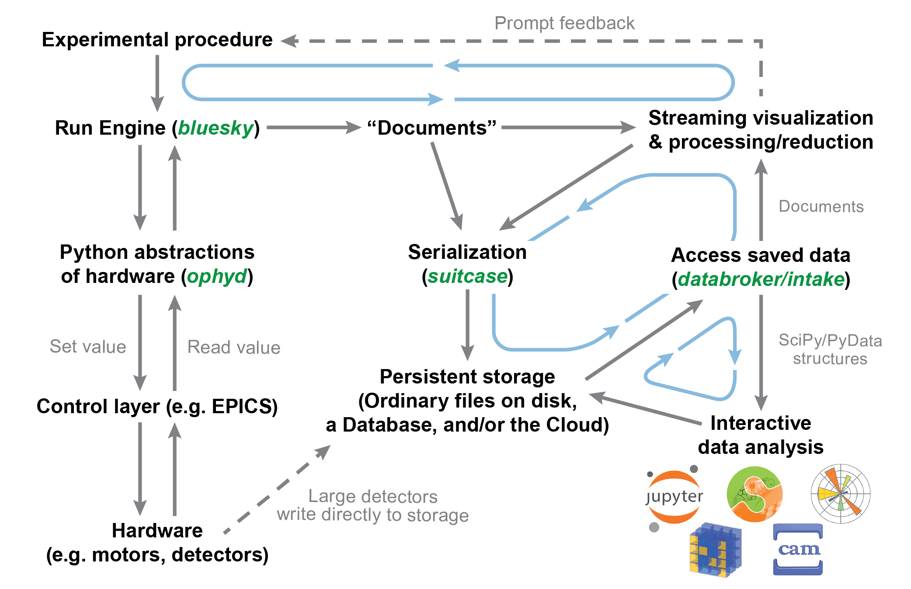
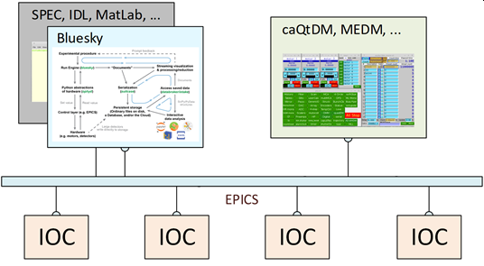

# Bluesky: Brief Introduction

*Bluesky* is a Python framework for instrument control & scientific data
acquisition, primarily using EPICS.

- [Bluesky: Brief Introduction](#bluesky-brief-introduction)
  - [Motivation](#motivation)
  - [Principal parts of The Bluesky framework](#principal-parts-of-the-bluesky-framework)
  - [How does it work?](#how-does-it-work)
  - [How does Bluesky fit in?](#how-does-bluesky-fit-in)

(Based on a [2021 slide set](https://anl.box.com/s/l506pozlzjvy8d5ttjxq3a1fev4q2z6h) prepared for the APS Spectroscopy SIG.  Other slide sets are available in [ANL's Box folder](https://anl.box.com/s/kityevv6n9x7ngll99z53acy76bp64ys).)

Abstract

The Bluesky framework provides Python tools for coordinating measurement
steps with data acquisition, analysis, and visualization.  For data
acquisition, it relies on the popular PyEpics library to connect with
the instrument control system.  For measurements, it provides a set of
standard scanning plans as well as provisions to customize or build your
own as needs dictate.  Visualization for data acquisition is provided
through the matplotlib package and Qt while for analysis, packages such
as dask, pandas, and others may be used.  Data may be exported in a
variety of formats with existing tools or into a different format with
your own tool.  As used at APS, primary data will be stored in a mongodb
database for each instrument with Python tools available for retrieval
and catalogging.

## Motivation

Improve the experimental efficiency of our users.

_A huge part of my job is to set these experiments up for success._
(Mary Upton, Physicist, APS Instrument Scientist)

- EPICS for instrument controls
- Bluesky framework:
  - sequence the X-ray measurements
  - collect & coordinate data & metadata
  - access the data after the measurement for analysis
  - export the data for other tools or offsite use

## Principal parts of The Bluesky framework

- [**ophyd**](https://blueskyproject.io/ophyd/)
  - Hardware Abstraction Layer
  - Signals & Devices with human-friendly names that propagate into metadata
  - Talks to [EPICS](https://epics.anl.gov/) via [PyEpics](https://pyepics.github.io/pyepics/)
- [**bluesky**](https://blueskyproject.io/bluesky/)
  - Orchestrate the scan
  - Collect & publish data (plot, table, database, file, socket, ...)
  - Basic data visualization
  - Handle interruptions (no beam, shutter closed, ...)
- [**databroker**](https://blueskyproject.io/databroker/)
  - Rich search & access to saved data
  - Separates data from file format
  - Discoverable data repositories
- [**apstools**](https://apstools.readthedocs.io/)
  - Various Python tools for use with Bluesky at the APS
  - synApps Devices & APS-specific Devices (undulator, shutter, ...)
  - APS storage ring `current`
  - Information from APS Proposal and ESAF databases

info | web address
--- | ---
Docs | https://blueskyproject.io/
Code | https://github.com/bluesky/
`apstools` | https://github.com/BCDA-APS/apstools/

## How does it work?

- Measurements are controlled by the `bluesky.RunEngine` as plans
  - Plans are defined by Python functions
  - Collected data is published:
    - **databroker** for storage
    - Subscribers (callbacks) for visualization, export, and other
  - Use standard plans or construct your own custom plans
    - Embed a plan inside another plan (such as this hypothetical):
      - step scan temperature *T* through a range
      - scan _$\theta$-$2\theta$_ at every *T*
- _Moveable_ Devices or Signals can be scanned
- _Readable_ Devices or Signals can be detectors
  - Devices and Signals are defined by Python classes
  - Signals connect with EPICS PVs
- Other Signals can be monitored during a measurement

## How does Bluesky fit in?

Bluesky is a user interface for data collection using EPICS.  It can
also interface with other controls (such as native Python, LabView,
network sockets) but these interfaces will require effort to implement.

- Works with existing EPICS controls (IOCs & PVs)
  - even area detectors
- Coordinates data collection and analysis with X-ray experiments
- Works along with existing GUIs
- Pre-built and customized measurement procedures
- Delivers data and metadata for your analysis processes
