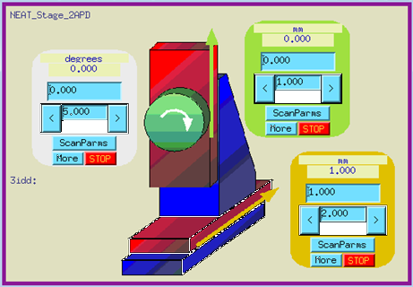

.. index:: ! custom ophyd device

.. https://github.com/BCDA-APS/bluesky_training/issues/42

.. _howto-custom-device:

===============
Custom Devices
===============

.. warning:: Work-in-Progress

Within the Bluesky Framework, the *bluesky* [#bluesky]_ package, orchestrates
measurements and acquires data. Hardware components from various control systems
(such as [EPICS](https://epics-controls.org/)) connect to *bluesky* through the
the *ophyd* [#ophyd]_ package. This separation generalizes underlying control
system details of specific devices and separates them from generalized
measurement procedures.

This document describes how to create custom *ophyd* Devices.

.. sidebar:: `Form follows function <https://en.wikipedia.org/wiki/Form_follows_function>`_

    Integral to the implementation of a custom ``ophyd.Device`` is the
    consideration of its architecture: *how is the control provided* and
    *how will it be used*.

*Ophyd*, a hardware abstraction layer connects with the underlying control
system (such as EPICS) and describes the objects for control as either a
*Signal* (a single-valued object for control) or a *Device* (built up from
Signal and/or Device components).

.. note::  This document was written for the ophyd v1 Device
    specification. [#v1_device]_

    At the time of this writing, the ophyd v2 Device
    specification [#v2_device]_ has not been released from its draft form.

Both *Signal* and *Device* are Python classes.  The methods of these classes
describe actions specific to that class.  Subclasses, such as `EpicsSignal` and
`EpicsMotor` augment the basic capabilities with additional capabilities.

.. caution:: Could start with more basic examples. Make note of common prefix.

Reasons for a custom *ophyd* Device include:

- groupings (such as: related metadata or a motor stage)
- modify existing Device
- custom configuration (such as area detector)
- new support
- pseudo-positioner

Each of these will be presented in the sections below.

Simple Examples
================

Perhaps the best starting point is one or two simple examples.

Hello, World!
~~~~~~~~~~~~~~~~

.. TODO: link to the _hello_world notebook.

The ``HelloDevice`` (in the `Hello, World!
<https://bcda-aps.github.io/bluesky_training/tutor/_hello_world.html>`_
notebook) is a subclass of `ophyd.Device`.

.. TODO:  Complete this section

.. code-block:: python
    :linenos:

    from ophyd import Component, Device, Signal

    class HelloDevice(Device):
        number = Component(Signal, value=0, kind="hinted")
        text = Component(Signal, value="", kind="normal")

.. comment
    hello_device = HelloDevice(name="hello")
    hello_device.stage_sigs["number"] = 1
    hello_device.stage_sigs["text"] = "Hello, World!"
    hello_device.number.name = hello_device.name

    def hello_world():
        """Simple bluesky plan for demonstrating Hello, World!."""
        yield from bp.count([hello_device], md=dict(title="test QS"))

Connect with EPICS
~~~~~~~~~~~~~~~~~~

The ``MyGroup`` (in the `Connect Bluesky with EPICS
<https://bcda-aps.github.io/bluesky_training/tutor/connect_epics.html>`_
notebook) is a subclass of `ophyd.Device` that connects with EPICS.  The
notebook also describes the ``wait_for_connection()`` method.

.. TODO: finish

Groupings
=========

A custom Device may be created to group several controls together as they relate
to a common object, such as a motorized stage or even an abstract object such as
undulator or monochoromator energy.  A Device might refer to some other grouping
of information, such as the proposal information related to the current
measurements.  Presented here are a few examples of the many possibilities.

Neat Stage 2APD
~~~~~~~~~~~~~~~

.. rubric:: NEAT Stage

The *NEAT Stage*, stage from APS station 3-ID-D, consists of
three motorized axes, as described in the next table.

============== ===========  ======================
axis name      EPICS PV     description
============== ===========  ======================
:math:`x`      ``3idd:m1``  horizontal translation
:math:`y`      ``3idd:m2``  vertical translation
:math:`\theta` ``3idd:m3``  rotation
============== ===========  ======================

.. code-block:: python
    :linenos:

    class NeatStage_3IDD(Device):
        x = Component(EpicsMotor, "m1", labels=("NEAT stage",))
        y = Component(EpicsMotor, "m2", labels=("NEAT stage",))
        theta = Component(EpicsMotor, "m3", labels=("NEAT stage",))

    neat_stage = NeatStage_3IDD("3idd:", name="neat_stage")

.. TODO: describe how it will be used, read, summary, ...

APS Undulator
~~~~~~~~~~~~~~~

In the *apstools* [#apstools]_ package, the `ApsUndulator
<https://github.com/BCDA-APS/apstools/blob/d87ca0782bbcc7339bdda328b90f734f9957eaa6/apstools/devices/aps_undulator.py#L20-L63>`_
Device groups the EPICS PVs into Device.  This makes it easy to access useful
controls such as ``undulator.energy``, and to record the undulator configuration
for data acquisition.

.. code-block:: python
    :linenos:

    class ApsUndulator(Device):
        """
        APS Undulator

        EXAMPLE::

            undulator = ApsUndulator("ID09ds:", name="undulator")
        """

        energy = Component(EpicsSignal, "Energy", write_pv="EnergySet", put_complete=True, kind="hinted")
        energy_taper = Component(EpicsSignal, "TaperEnergy", write_pv="TaperEnergySet", kind="config")
        gap = Component(EpicsSignal, "Gap", write_pv="GapSet")
        gap_taper = Component(EpicsSignal, "TaperGap", write_pv="TaperGapSet", kind="config")
        start_button = Component(EpicsSignal, "Start", put_complete=True, kind="omitted")
        stop_button = Component(EpicsSignal, "Stop", kind="omitted")
        harmonic_value = Component(EpicsSignal, "HarmonicValue", kind="config")
        gap_deadband = Component(EpicsSignal, "DeadbandGap", kind="config")
        device_limit = Component(EpicsSignal, "DeviceLimit", kind="config")
        # ... more

APS Dual Undulator
~~~~~~~~~~~~~~~~~~

The APS Dual Undulator consists of two APS Undulator devices, installed
end-to-end in the storage ring.  The two devices are referred to as *upstream*
and *downstream*, as described in the next table.

==============  =================  ==================
undulator name  EPICS PV (prefix)  description
==============  =================  ==================
us              ``45ID:us:``        upstream undulator
ds              ``45ID:ds:``        downstream undulator
==============  =================  ==================

Keep in mind that the overall prefix `45ID:` will be provided when the Python
object is created (below).  In the ``ApsUndulatorDual`` class below, the
combined prefix of ``45ID:us:`` will be passed to the upstream undulator.
Similarly, ``45ID:ds:`` for the downstream undulator.

.. code-block:: python
    :linenos:

    class ApsUndulatorDual(Device):
        upstream = Component(ApsUndulator, "us:")
        downstream = Component(ApsUndulator, "ds:")

Now, create the Python object for the dual APS Undulator controls:

.. code-block:: python
    :linenos:

    undulator = ApsUndulatorDual("45ID:", name="undulator")

The undulator energy of each is accessed by ``undulator.us.energy.get()`` and
``undulator.ds.energy.get()``.

.. maybe
    User Info
    ~~~~~~~~~~~~~~~~~~

    aggregate custom data ...

    .. Perhaps NO to this example since apsbss provides...

    .. code-block:: python
        :linenos:

        class ExperimentInfo(Device):		# from the APS General User Proposal system
            GUP_number = Component(EpicsSignalRO, "ProposalNumber", string=True)
            title = Component(EpicsSignalRO, "ProposalTitle", string=True)
            user_name = Component(EpicsSignalRO, "UserName", string=True)
            user_institution = Component(EpicsSignalRO, "UserInstitution", string=True)
            user_badge_number = Component(EpicsSignalRO, "UserBadge", string=True)

        user_info = ExperimentInfo("2bmS1:", name="user_info")

Modify existing Device
======================

.. TODO includes mixin devices

Sometimes, a *standard* device is missing a feature, such as connection with an
additional field (or fields) in an EPICS record. A *mixin* class can modify
a class by providing additional structures and/or methods

.. tip:: An advantage to using these custom *mixin* classes is that all these
    additional fields and methods will have consistent names.  This simplifies
    both data acquisition and 
    the process of searching and matching acquired data in the database.

EPICS ``ai`` & ``ao`` Records
~~~~~~~~~~~~~~~~~~~~~~~~~~~~~~~

One variation might be recognizing that all of the PVs are the same (or similar)
EPICS record type, such as EPICS ``ai``  and ``ao`` records.  These records are
all floating point PVs which share many extra fields.  The difference is that
``ai`` records are read-only while ``ao`` records can be changed from Bluesky.
The extra fields follow two common EPICS patterns:

- fields common to all EPICS records
- fields common EPICS floating-point value records

Support for these common fields [#epics_common_fields]_ is provided in the
*apstools* [#apstools]_ package.  Make custom Devices including the additional
configuration support from apstools.  Like this:

.. code-block:: python
    :linenos:

    from apstools.synApps import EpicsRecordDeviceCommonAll
    from apstools.synApps import EpicsRecordFloatFields
    from ophyd import Component, Device, EpicsSignal, EpicsSignalRO

    class EpicsAiRecord(EpicsRecordFloatFields, EpicsRecordDeviceCommonAll):
        signal = Component(EpicsSignalRO, ".VAL")  # read-only

    class EpicsAoRecord(EpicsRecordFloatFields, EpicsRecordDeviceCommonAll):
        signal = Component(EpicsSignal, ".VAL")  # read & write

This gives you many, many additional fields with standard names, such as:

.. code-block:: python
    :linenos:

    description = Component(EpicsSignal, ".DESC", kind="config")
    processing_active = Component(EpicsSignalRO, ".PACT", kind="omitted")
    scanning_rate = Component(EpicsSignal, ".SCAN", kind="config")
    disable_value = Component(EpicsSignal, ".DISV", kind="config")
    scan_disable_input_link_value = Component(EpicsSignal, ".DISA", kind="config")
    scan_disable_value_input_link = Component(EpicsSignal, ".SDIS", kind="config")
    process_record = Component(EpicsSignal, ".PROC", kind="omitted", put_complete=True)
    forward_link = Component(EpicsSignal, ".FLNK", kind="config")
    trace_processing = Component(EpicsSignal, ".TPRO", kind="omitted")
    device_type = Component(EpicsSignalRO, ".DTYP", kind="config")

    alarm_status = Component(EpicsSignalRO, ".STAT", kind="config")
    alarm_severity = Component(EpicsSignalRO, ".SEVR", kind="config")
    new_alarm_status = Component(EpicsSignalRO, ".NSTA", kind="config")
    new_alarm_severity = Component(EpicsSignalRO, ".NSEV", kind="config")
    disable_alarm_severity = Component(EpicsSignal, ".DISS", kind="config")

    units = Component(EpicsSignal, ".EGU", kind="config")
    precision = Component(EpicsSignal, ".PREC", kind="config")

    monitor_deadband = Component(EpicsSignal, ".MDEL", kind="config")

To use these custom Devices, consider a hypothetical controller with these
controls.

=========== =========   ============    =================
signal      direction   EPICS PV        description
=========== =========   ============    =================
pressure    input       ``ioc:ai4``     pressure gauge
temperature input       ``ioc:ai2``     thermocouple
flow        output      ``ioc:ao12``    flow control
voltage     output      ``ioc:ao13``    applied voltage
=========== =========   ============    =================

Recognize that all these EPICS PVs share a common prefix: ``ioc:``.
Define the custom Device:

.. code-block:: python
    :linenos:

    class MyController(Device):
        pressure = Component(EpicsAiRecord, "ai4")
        temperature = Component(EpicsAiRecord, "ai2")
        flow = Component(EpicsAoRecord, "ao12")
        voltage = Component(EpicsAoRecord, "ao13")

Create the Python object with the common prefix:

.. code-block:: python
    :linenos:

    # create the Python object:
    controller = MyController("ioc:", name="controller")

.. For example, the ``ophyd.EpicsMotor`` does not connect with every field of the EPICS motor record.

.. TODO pick a different example (CamMixin) since this example is a very limited case.
    To enable changing the motor resolution at runtime:

    class MyEpicsMotor(EpicsMotor):
        steps_per_revolution = Component(EpicsSignal, ".SREV", kind="omitted")

    Also see
    - [CamMixin](https://github.com/BCDA-APS/apstools/blob/d87ca0782bbcc7339bdda328b90f734f9957eaa6/apstools/devices/area_detector_support.py#L732-L739) - updates a text attribute
    - [SingleTrigger](https://github.com/BCDA-APS/apstools/blob/d87ca0782bbcc7339bdda328b90f734f9957eaa6/apstools/devices/area_detector_support.py#L742-L770) - overrides existing methods (`__init__()`, `stage()`, `unstage()`)

Custom configurations
======================

such as area detector

.. TODO

New support
======================

.. TODO

Pseudo-positioner
======================

.. TODO

-------------

.. rubric:: Footnotes

.. [#apstools] *apstools* :  https://bcda-aps.github.io/apstools/latest/
.. [#bluesky] *bluesky* : https://blueskyproject.io/bluesky
.. [#epics_common_fields] EPICS common fields : https://bcda-aps.github.io/apstools/latest/api/synApps/__common.html
.. [#ophyd] *ophyd* : https://blueskyproject.io/ophyd
.. [#v1_device] *ophyd* v1 Device : https://blueskyproject.io/ophyd/user_v1/tutorials/device.html#define-a-custom-device
.. [#v2_device] *ophyd* v2 Device : https://blueskyproject.io/ophyd/user_v2/how-to/make-a-simple-device.html
