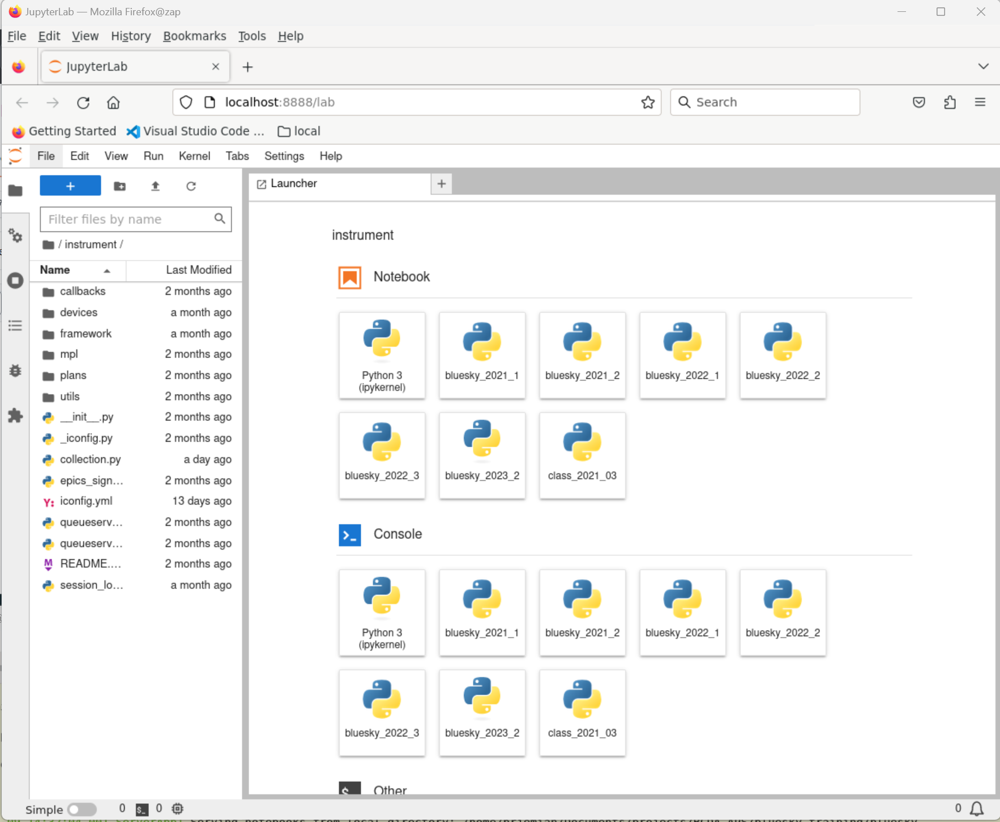

# Getting started

## How to start a Bluesky session?

There are several ways to start a Bluesky session:

- IPython console
- Jupyter notebook
- Bluesky queueserver
- background process
- unit testing

Some of these may involve loading a specially configured `instrument` package.
See the
[Instrument](https://bcda-aps.github.io/bluesky_training/instrument/index.html)
section for more details.

In this document, routine startup of an IPython console session and a JupyterLab
notebook session will be demonstrated.  The `blueskyStarter.sh` script was
created to start a Bluesky session for routine data acquisition at beamlines.
It is installed in the `~/bluesky` directory.  The script may be used from any
shell in any directory to start a bluesky session in IPython console (default)
or Jupyter notebook GUI.

### Use `blueskyStarter.sh` to start a console session

This next command shows how to start an IPython console session with the
`instrument` package loaded and ready for data acquisition:

<pre>
$ <b>blueskyStarter.sh</b>
(base) user@host:~$ cd /tmp
(base) user@host:/tmp$ blueskyStarter.sh
==> CONDA_PREFIX=/home/user/.conda/envs/bluesky_2023_3
/home/user/.conda/envs/bluesky_2023_3/bin/python -- Python 3.10.10
Python 3.10.10 | packaged by conda-forge | (main, Mar 24 2023, 20:08:06) [GCC 11.3.0]
Type 'copyright', 'credits' or 'license' for more information
IPython 8.12.0 -- An enhanced Interactive Python. Type '?' for help.

IPython profile: bluesky
Exception reporting mode: Minimal
/home/user/bluesky/instrument/_iconfig.py
Activating auto-logging. Current session state plus future input saved.
Filename       : /tmp/.logs/ipython_console.log
... more lines of output ...
I Tue-14:44:57 - #### Startup is complete. ####

In [1]:
</pre>

At this point, the console session is ready for your data acquisition
activities.

### Use `blueskyStarter.sh` to start a notebook session

The next command shows how to start a Jupyter notebook session:

<pre>
$ <b>blueskyStarter.sh lab</b>
==> CONDA_PREFIX=/home/prjemian/.conda/envs/bluesky_2023_3
Could not activate environment: 'bluesky_2023_3'
Installed kernelspec bluesky_2023_3 in /home/prjemian/.local/share/jupyter/kernels/bluesky_2023_3
[I 2023-05-09 14:32:03.687 ServerApp] Package jupyterlab took 0.0000s to import
[I 2023-05-09 14:32:03.690 ServerApp] Package jupyter_server_fileid took 0.0022s to import
... more lines of output ...
</pre>

Shortly, the [JupyterLab](https://jupyterlab.readthedocs.io/en/stable/index.html) Launcher will appear in the web browser.

Many of the How-To guides and tutorials, such as the [Bluesky cheat
sheet](https://bcda-aps.github.io/bluesky_training/tutor/_command_review.html)
use a Jupyter notebook for data acquisition with the `instrument` package.
