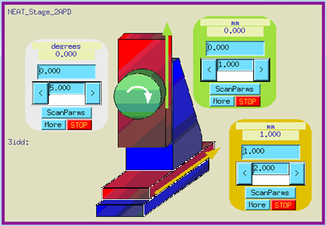

.. index:: ! custom ophyd device

.. https://github.com/BCDA-APS/bluesky_training/issues/42

.. _howto-custom-device:

===============
Custom Devices
===============

.. sidebar:: Form follows function [#fff]_

    Integral to the implementation of a custom ``ophyd.Device`` is the
    consideration of its architecture: *how is the control provided* and
    *how will it be used*.

Within the Bluesky Framework, the *bluesky* [#bluesky]_ package, orchestrates
measurements and acquires data. Hardware components from various control systems
(such as EPICS [#epics]_) connect to *bluesky* through the
the *ophyd* [#ophyd]_ package. This separation generalizes underlying control
system details of specific devices and separates them from generalized
measurement procedures.

This document describes how to create custom *ophyd* Devices.

*Ophyd*, a hardware abstraction layer connects with the underlying control
system (such as EPICS) and describes the objects for control as either a
*Signal* (a single-valued object for control) or a *Device* (built up from
Signal and/or Device components).

.. note::  This document was written for the ophyd v1 Device
    specification. [#v1_device]_

    At the time of this writing, the ophyd v2 Device
    specification [#v2_device]_ has not been released from its draft form.

Both *Signal* and *Device* are Python classes.  The methods of these classes
describe actions specific to that class.  Subclasses, such as `EpicsSignal` and
`EpicsMotor` augment the basic capabilities with additional capabilities.

Reasons for a custom *ophyd* Device include:

- groupings (such as: related metadata or a motor stage)
- modify existing Device
- custom configuration (such as area detector)
- new support
- pseudo-positioner

Each of these will be presented in the sections below.

Simple Devices
==============

Perhaps the best starting point is one or two simple examples of *ophyd*
Devices.

Hello, World!
~~~~~~~~~~~~~

The ``HelloDevice`` (in the `Hello, World!
<https://bcda-aps.github.io/bluesky_training/tutor/_hello_world.html>`_
notebook) is a subclass of `ophyd.Device`.

.. code-block:: python
    :linenos:

    from ophyd import Component, Device, Signal

    class HelloDevice(Device):
        number = Component(Signal, value=0, kind="hinted")
        text = Component(Signal, value="", kind="normal")

``HelloDevice`` declares two ``ophyd.Signal`` (non-EPICS) components, ``number``
and ``text``. ``hello_device`` is an instance of ``HelloDevice``:

.. code-block:: python
    :linenos:

    hello_device = HelloDevice(name="hello")

It is required to specify the ``name`` keyword argument (also known as
':index:`kwarg`').  By convention, we use the same name as the Python `instance
<https://stackoverflow.com/questions/61713990>`__

The *Hello, World!* example uses `staging
<https://blueskyproject.io/ophyd/user_v1/explanations/staging.html>`__ to change
the component values:

.. code-block:: python
    :linenos:

    hello_device.stage_sigs["number"] = 1
    hello_device.stage_sigs["text"] = "Hello, World!"

.. index:: staging

When ``hello_device`` is :index:`staged` (by the bluesky RunEngine), the value
of ``hello_device.number`` will be changed from ``0`` to ``1`` and the value of
``hello_device.text`` will be changed from ``""`` to ``"Hello, World!"``. Before
finishing the run, the RunEngine will :index:`unstage` all ophyd Devices,
meaning that the previous values are restored.

We *expect* the ``number`` component to contain numerical values and the
``text`` component to contain text values. To keep the example simple, we have
not added `type <https://docs.python.org/3/library/typing.html>`__ hints.

``.read()``
^^^^^^^^^^^

All ophyd ``Signal`` and ``Device`` instances have a ``.read()`` [#read]_  method.  The
``.read()`` method returns the current value of each component and the timestamp
(`time <https://docs.python.org/3/library/time.html#time.time>`__ in seconds
since the system *epoch*) when that value was received in Python.  The
``.read()`` method is called by data acquisition during execution of a bluesky
plan.  The *keys* of the Python dictionary returned by ``.read()`` are the full
names of each component.  Here's an example:

.. code-block:: python
    :linenos:

    In [4]: hello_device.read()
    Out[4]:
    OrderedDict([('hello_number', {'value': 0, 'timestamp': 1685123274.1847932}),
                ('hello_text', {'value': '', 'timestamp': 1685123274.1848683})])

``.summary()``
^^^^^^^^^^^^^^

All ophyd ``Device`` instances have a ``.summary()`` method to explain
a Device to an interactive user.  Here is ``hello_device.summary()``:

.. code-block:: python
    :linenos:

    In [5]: hello_device.summary()
    data keys (* hints)
    -------------------
    *hello_number
    hello_text

    read attrs
    ----------
    number               Signal              ('hello_number')
    text                 Signal              ('hello_text')

    config keys
    -----------

    configuration attrs
    -------------------

    unused attrs
    ------------

``.stage()``
^^^^^^^^^^^^^^

Here is the result of staging ``hello_device``:

.. code-block:: python
    :linenos:

    In [8]: hello_device.unstage()
    Out[8]: [HelloDevice(prefix='', name='hello', read_attrs=['number', 'text'], configuration_attrs=[])]

    In [9]: hello_device.read()
    Out[9]:
    OrderedDict([('hello_number', {'value': 0, 'timestamp': 1685123542.713047}),
                ('hello_text', {'value': '', 'timestamp': 1685123542.7126422})])

``.unstage()``
^^^^^^^^^^^^^^

Here is the result of unstaging ``hello_device``:

.. code-block:: python
    :linenos:

    In [8]: hello_device.unstage()
    Out[8]: [HelloDevice(prefix='', name='hello', read_attrs=['number', 'text'], configuration_attrs=[])]

    In [9]: hello_device.read()
    Out[9]:
    OrderedDict([('hello_number', {'value': 0, 'timestamp': 1685123542.713047}),
                ('hello_text', {'value': '', 'timestamp': 1685123542.7126422})])

Connect with EPICS
~~~~~~~~~~~~~~~~~~

EPICS is a control system completely separate from Python.
``MyGroup`` (in the `Connect Bluesky with EPICS
<https://bcda-aps.github.io/bluesky_training/tutor/connect_epics.html>`_
notebook) is a subclass of `ophyd.Device` that connects with EPICS.

When an instance of an ophyd Device is created, a common PV prefix is provided
as the first argument.  This prefix is used with all EPICS components in the
class. A *reuseable* class (such as ``ophyd.EpicsMotor``) is created with this
design consideration.  The prefix is provided when the instance is created.  (If
there is no common prefix, then an empty string is provded.)  In this example,
we have these EPICS PVs to connect:

======================= =======================
full PV                 description
======================= =======================
``kgp:gp:bit1``         enable
``kgp:gp:float1``       setpoint
``kgp:gp:float1.EGU``   units
``kgp:gp:text1``        label
======================= =======================

Separating the common PV prefix, we create a ``MyGroup`` Device that connects
these PVs (using the remaining PV suffix for each).  Remember to provide the
common PV prefix:

.. code-block:: python
    :linenos:

    from ophyd import Component, Device, EpicsSignal

    class MyGroup(Device):
        enable = Component(EpicsSignal, "gp:bit1")
        setpoint = Component(EpicsSignal, "gp:float1")
        units = Component(EpicsSignal, "gp:float1.EGU")
        label = Component(EpicsSignal, "gp:text1")

``ophyd.EpicsSignal``, a variation of ``ophyd.Signal``, provides a connection
with the EPICS control system. The text argument after ``EpicsSignal`` (such as
``"gp:bit1"``) is the EPICS Process Variable (or suffix).  A PV [#pv]_ is a text
identifier for a unit [#pv_intro]_ of EPICS data. EPICS is responsible for
updating the PV with new content, as directed by one or more clients, such as
*ophyd*.

.. index:: wait_for_connection

``.wait_for_connection()``
^^^^^^^^^^^^^^^^^^^^^^^^^^^^^^^^^^^^^^

We must allow some time after creating an instance, albeit short, for the
instance to connect by calling its ``wait_for_connection()`` `method
<https://nsls-ii.github.io/ophyd/device-overview.html#low-level-api>`__:

.. code-block:: python
    :linenos:

    group = MyGroup("kgp:", name="group")
    group.wait_for_connection()

.. tip:: ``wait_for_connection()`` is not always used

    For most use (such as interactive sessions), a call to an
    instance's ``wait_for_connection()`` method does not *appear*
    to be necessary.  EPICS connections usually happen very fast,
    unless a requested PV is not available.  This is why you do not see
    ``wait_for_connection()`` called in most library code.  However,
    when the instance is to be used
    immediately, you should use the ``wait_for_connection()`` method
    before interacting with the instance.

.. TODO:
    'kind'
    ^^^^
    Could divert and explain how the ``kind`` kwarg affects
    what components are not reported with .`read()`

``.summary()``
^^^^^^^^^^^^^^

Here is ``group.summary()``:

.. code-block:: python
    :linenos:

    In [4]: group.summary()
    data keys (* hints)
    -------------------
    group_enable
    group_label
    group_setpoint
    group_units

    read attrs
    ----------
    enable               EpicsSignal         ('group_enable')
    setpoint             EpicsSignal         ('group_setpoint')
    units                EpicsSignal         ('group_units')
    label                EpicsSignal         ('group_label')

    config keys
    -----------

    configuration attrs
    -------------------

    unused attrs
    ------------

Groupings
=========

A custom Device may be created to group several controls together as they relate
to a common object, such as a motorized stage or even an abstract object such as
undulator or monochoromator energy.  A Device might refer to some other grouping
of information, such as the proposal information related to the current
measurements.  Presented here are a few examples of the many possibilities.

Neat Stage 2APD
~~~~~~~~~~~~~~~

.. rubric:: NEAT Stage

The *NEAT Stage 2APD*, stage from APS station 3-ID-D, consists of
three motorized axes, as described in the next table.

============== ===========  ======================
axis name      EPICS PV     description
============== ===========  ======================
:math:`x`      ``3idd:m1``  horizontal translation
:math:`y`      ``3idd:m2``  vertical translation
:math:`\theta` ``3idd:m3``  rotation
============== ===========  ======================

Since each of these axes are EPICS motors, we'll use ``ophyd.EpicsMotor``
[#epics_motor]_ to connect with the rich set of EPICS controls for each:

.. code-block:: python
    :linenos:

    from ophyd import Component, Device, EpicsMotor

    class NeatStage_3IDD(Device):
        x = Component(EpicsMotor, "m1", labels=("NEAT stage",))
        y = Component(EpicsMotor, "m2", labels=("NEAT stage",))
        theta = Component(EpicsMotor, "m3", labels=("NEAT stage",))

    neat_stage = NeatStage_3IDD("3idd:", name="neat_stage")

APS Undulator
~~~~~~~~~~~~~~~

In the *apstools* [#apstools]_ package, the `ApsUndulator
<https://github.com/BCDA-APS/apstools/blob/d87ca0782bbcc7339bdda328b90f734f9957eaa6/apstools/devices/aps_undulator.py#L20-L63>`_
Device groups the EPICS PVs into Device.  This makes it easy to access useful
controls such as ``undulator.energy``, and to record the undulator configuration
for data acquisition.

.. code-block:: python
    :linenos:

    from ophyd import Component, Device, EpicsSignal

    class ApsUndulator(Device):
        """
        APS Undulator

        EXAMPLE::

            undulator = ApsUndulator("ID09ds:", name="undulator")
        """

        energy = Component(EpicsSignal, "Energy", write_pv="EnergySet", put_complete=True, kind="hinted")
        energy_taper = Component(EpicsSignal, "TaperEnergy", write_pv="TaperEnergySet", kind="config")
        gap = Component(EpicsSignal, "Gap", write_pv="GapSet")
        gap_taper = Component(EpicsSignal, "TaperGap", write_pv="TaperGapSet", kind="config")
        start_button = Component(EpicsSignal, "Start", put_complete=True, kind="omitted")
        stop_button = Component(EpicsSignal, "Stop", kind="omitted")
        harmonic_value = Component(EpicsSignal, "HarmonicValue", kind="config")
        gap_deadband = Component(EpicsSignal, "DeadbandGap", kind="config")
        device_limit = Component(EpicsSignal, "DeviceLimit", kind="config")
        # ... more

APS Dual Undulator
~~~~~~~~~~~~~~~~~~

The APS Dual Undulator consists of two APS Undulator devices, installed
end-to-end in the storage ring.  The two devices are referred to as *upstream*
and *downstream*, as described in the next table.

==============  =================  ==================
undulator name  EPICS PV (prefix)  description
==============  =================  ==================
us              ``45ID:us:``        upstream undulator
ds              ``45ID:ds:``        downstream undulator
==============  =================  ==================

Keep in mind that the overall prefix `45ID:` will be provided when the Python
object is created (below).  In the ``ApsUndulatorDual`` class below, the
combined prefix of ``45ID:us:`` will be passed to the upstream undulator.
Similarly, ``45ID:ds:`` for the downstream undulator.

.. code-block:: python
    :linenos:

    class ApsUndulatorDual(Device):
        upstream = Component(ApsUndulator, "us:")
        downstream = Component(ApsUndulator, "ds:")

Now, create the Python object for the dual APS Undulator controls:

.. code-block:: python
    :linenos:

    undulator = ApsUndulatorDual("45ID:", name="undulator")

The undulator energy of each is accessed by ``undulator.us.energy.get()`` and
``undulator.ds.energy.get()``.

.. index:: mixin device

Modify existing Device
======================

Sometimes, a *standard* device is missing a feature, such as connection with an
additional field (or fields) in an EPICS record. A *mixin* class can modify
a class by providing additional structures and/or methods.
The *apstools* package provides mixin classes [#apstools_mixins]_ for fields common to
various EPICS records types.

.. tip:: An advantage to using these custom *mixin* classes is that all these
    additional fields and methods will have consistent names.  This simplifies
    both data acquisition and
    the process of searching and matching acquired data in the database.

For example, we might want to define a new feature that is not yet present in
*ophyd*.  Here, we define a ``home_value`` component.  The position can be
either preset or changed programmatically.

.. code-block:: python
    :linenos:

    from ophyd import Component, Device, Signal

    class HomeValue(Device):
        home_value = Component(Signal)

We can use ``HomeValue()`` as a *mixin* class to modify (actually, create a
variation of) the ``MyGroup`` (above):

.. code-block:: python
    :linenos:

    class MyGroupWithHome(HomeValue, MyGroup):
        """MyGroup with known home value."""

Create an instance and view its `.summary()`:

.. code-block:: python
    :linenos:

    In [23]: group = MyGroupWithHome("kgp:", name="group")

    In [24]: group.summary()
    data keys (* hints)
    -------------------
    group_enable
    group_home_value
    group_label
    group_setpoint
    group_units

    read attrs
    ----------
    enable               EpicsSignal         ('group_enable')
    setpoint             EpicsSignal         ('group_setpoint')
    units                EpicsSignal         ('group_units')
    label                EpicsSignal         ('group_label')
    home_value           Signal              ('group_home_value')

    config keys
    -----------

    configuration attrs
    -------------------

    unused attrs
    ------------

Compare this most recent summary with the previous one.  Note the ``home_value``
Signal.

.. note:: A Device can define (or replace) methods, too.

    The ``apstools.synApps.EpicsSynAppsRecordEnableMixin`` mixin
    [#apstools_epics_mixins]_ includes a method in addition to a new component.

EPICS ``ai`` & ``ao`` Records
~~~~~~~~~~~~~~~~~~~~~~~~~~~~~~~

One variation might be recognizing that all of the PVs are the same (or similar)
EPICS record type, such as EPICS ``ai``  and ``ao`` records.  These records are
all floating point PVs which share many extra fields.  The difference is that
``ai`` records are read-only while ``ao`` records can be changed from Bluesky.
The extra fields follow two common EPICS patterns:

- fields common to all EPICS records
- fields common EPICS floating-point value records

Support for these common fields [#epics_common_fields]_ is provided in the
*apstools* [#apstools]_ package.  Make custom Devices including the additional
configuration support from apstools.  Like this:

.. code-block:: python
    :linenos:

    from apstools.synApps import EpicsRecordDeviceCommonAll
    from apstools.synApps import EpicsRecordFloatFields
    from ophyd import Component, Device, EpicsSignal, EpicsSignalRO

    class EpicsAiRecord(EpicsRecordFloatFields, EpicsRecordDeviceCommonAll):
        signal = Component(EpicsSignalRO, ".VAL")  # read-only

    class EpicsAoRecord(EpicsRecordFloatFields, EpicsRecordDeviceCommonAll):
        signal = Component(EpicsSignal, ".VAL")  # read & write

This gives you many, many additional fields with standard names, such as:

.. code-block:: python
    :linenos:

    description = Component(EpicsSignal, ".DESC", kind="config")
    processing_active = Component(EpicsSignalRO, ".PACT", kind="omitted")
    scanning_rate = Component(EpicsSignal, ".SCAN", kind="config")
    disable_value = Component(EpicsSignal, ".DISV", kind="config")
    scan_disable_input_link_value = Component(EpicsSignal, ".DISA", kind="config")
    scan_disable_value_input_link = Component(EpicsSignal, ".SDIS", kind="config")
    process_record = Component(EpicsSignal, ".PROC", kind="omitted", put_complete=True)
    forward_link = Component(EpicsSignal, ".FLNK", kind="config")
    trace_processing = Component(EpicsSignal, ".TPRO", kind="omitted")
    device_type = Component(EpicsSignalRO, ".DTYP", kind="config")

    alarm_status = Component(EpicsSignalRO, ".STAT", kind="config")
    alarm_severity = Component(EpicsSignalRO, ".SEVR", kind="config")
    new_alarm_status = Component(EpicsSignalRO, ".NSTA", kind="config")
    new_alarm_severity = Component(EpicsSignalRO, ".NSEV", kind="config")
    disable_alarm_severity = Component(EpicsSignal, ".DISS", kind="config")

    units = Component(EpicsSignal, ".EGU", kind="config")
    precision = Component(EpicsSignal, ".PREC", kind="config")

    monitor_deadband = Component(EpicsSignal, ".MDEL", kind="config")

To use these custom Devices, consider a hypothetical controller with these
controls.

=========== =========   ============    =================
signal      direction   EPICS PV        description
=========== =========   ============    =================
pressure    input       ``ioc:ai4``     pressure gauge
temperature input       ``ioc:ai2``     thermocouple
flow        output      ``ioc:ao12``    flow control
voltage     output      ``ioc:ao13``    applied voltage
=========== =========   ============    =================

Recognize that all these EPICS PVs share a common prefix: ``ioc:``.
Define the custom Device:

.. code-block:: python
    :linenos:

    class MyController(Device):
        pressure = Component(EpicsAiRecord, "ai4")
        temperature = Component(EpicsAiRecord, "ai2")
        flow = Component(EpicsAoRecord, "ao12")
        voltage = Component(EpicsAoRecord, "ao13")

Create the Python object with the common prefix:

.. code-block:: python
    :linenos:

    # create the Python object:
    controller = MyController("ioc:", name="controller")

.. TODO:
    Custom configurations
    ======================

    such as area detector

    .. TODO

    New support
    ======================

    .. TODO

    Pseudo-positioner
    ======================

    .. TODO

-------------

.. rubric:: Footnotes

.. [#apstools_epics_mixins] https://bcda-aps.github.io/apstools/latest/_modules/apstools/synApps/_common.html#EpicsSynAppsRecordEnableMixin
.. [#apstools_mixins] ``apstools.synApps`` mixin classes: https://github.com/BCDA-APS/apstools/blob/b9d959cd7beb70994b0fc2fca0f344ef160f9849/apstools/synApps/_common.py#L25-L109
.. [#apstools] *apstools* :  https://bcda-aps.github.io/apstools/latest/
.. [#bluesky] *bluesky* : https://blueskyproject.io/bluesky
.. [#epics] EPICS : https://epics-controls.org
.. [#epics_common_fields] EPICS common fields : https://bcda-aps.github.io/apstools/latest/api/synApps/__common.html
.. [#epics_motor] ``EpicsMotor``: https://blueskyproject.io/ophyd/builtin-devices.html?highlight=epicsmotor#epicsmotor
.. [#fff] Form follows function : https://en.wikipedia.org/wiki/Form_follows_function
.. [#ophyd] *ophyd* : https://blueskyproject.io/ophyd
.. [#pv_intro] PV introduction: https://docs.epics-controls.org/en/latest/specs/ca_protocol.html?highlight=Process%20Variable#process-variables
.. [#pv] PV: https://docs.epics-controls.org/en/latest/guides/EPICS_Intro.html#appendix-objects-vs-process-variables-discussion
.. [#read] ``.read()``: https://blueskyproject.io/ophyd/user_v1/tutorials/single-PV.html#read
.. [#v1_device] *ophyd* v1 Device : https://blueskyproject.io/ophyd/user_v1/tutorials/device.html#define-a-custom-device
.. [#v2_device] *ophyd* v2 Device : https://blueskyproject.io/ophyd/user_v2/how-to/make-a-simple-device.html
